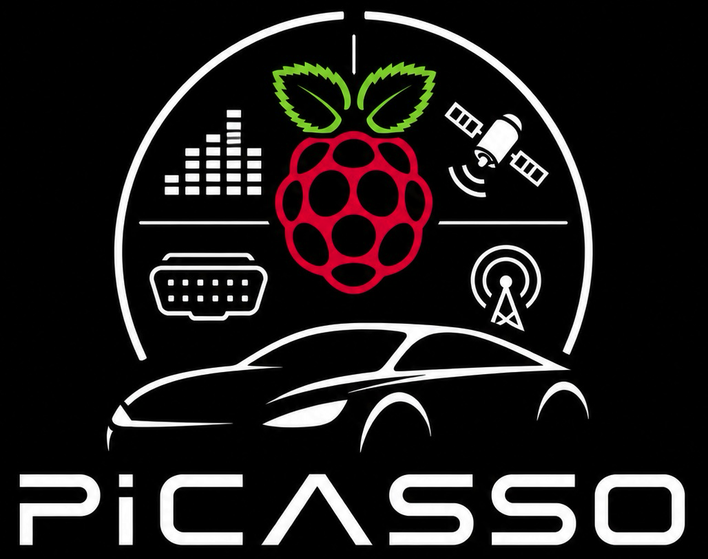
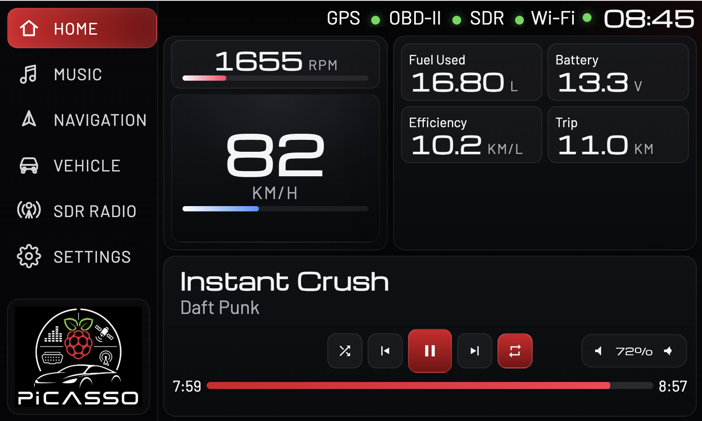
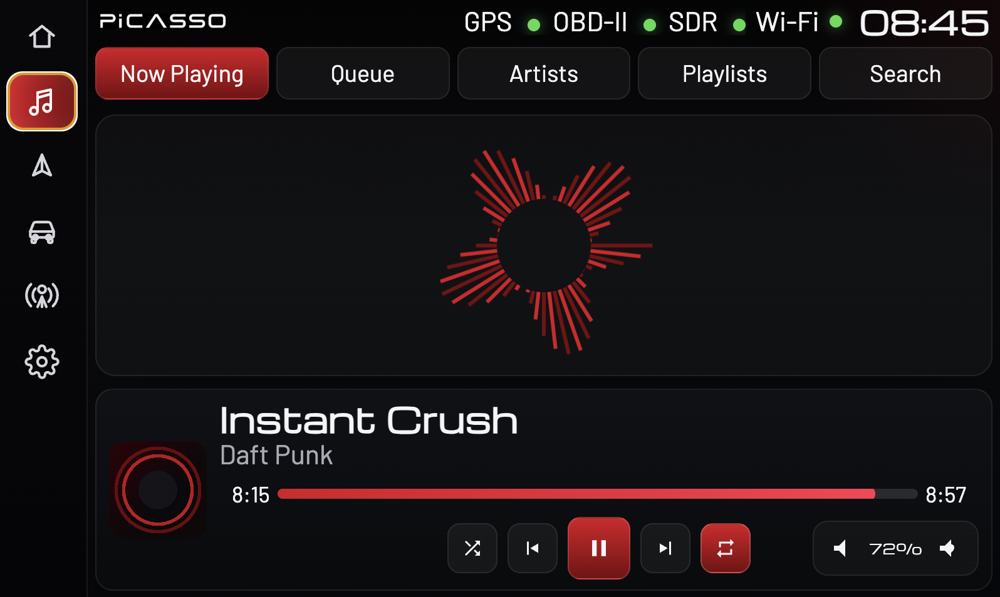
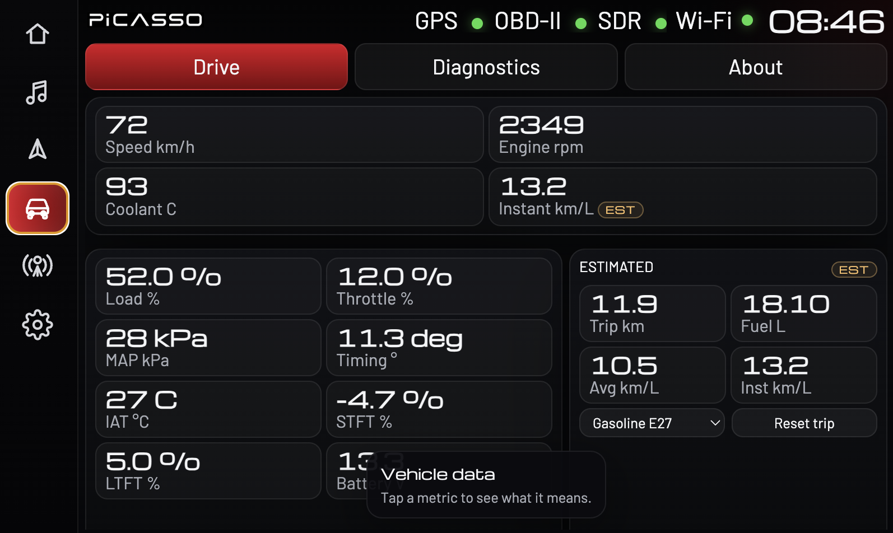

<p align="center">
  
</p>

<h1 align="center">PiCASSO</h1>

<p align="center"><em>Car Assistant for Smart Systems Onboard</em></p>

<p align="center">
  
  
  
</p>

A DIY vehicle infotainment system for older cars, built on a Raspberry Pi 4 driving a 7" touchscreen (800×480) in kiosk mode. PiCASSO unifies music playback, OBD-II diagnostics, SDR radio, GPS/navigation, and on-device settings behind a single touch-friendly web UI.

> The repository directory is still named `pi-car` for now; the product name is **PiCASSO**.

---

## Screenshots

| Home | Music | Vehicle |
|:---:|:---:|:---:|
|  |  |  |
| Speed dial, RPM, trip stats, now-playing card and Wi-Fi status | Now Playing with horizontal layout, audio visualizer and on-screen keyboard search | Three subtabs (Drive / Live OBD / Estimated) with sparklines, health highlights and VIN helpers |

---

## Features

| Module | Description | Status |
|--------|-------------|--------|
| **Music** | MPD player, library browsing, playlists, shuffle, 3-state repeat, queue, search with on-screen keyboard, click-to-seek progress bar | ✅ |
| **Vehicle (OBD-II)** | Three subtabs (Drive / Live OBD / Estimated), dynamic gauges, sparklines, health highlights, VIN helpers, contextual help overlays | ✅ |
| **SDR Radio** | RTL-SDR FM/AM with presets, aviation frequencies, real-time waterfall, favorites | ✅ |
| **Settings** | Wi-Fi indicator, media sync over SSH/rsync, system update controls, app restart with auto-reconnect | ✅ |
| **Boot splash** | Plymouth splash with the PiCASSO logo | ✅ |
| **Test mode** | `--teste` flag for hardware-free UI development | ✅ |
| **800×480 layout** | UI tuned for 7" automotive displays | ✅ |
| **GPS / Navigation** | Speed, satellites, coordinates, Navit integration | 🚧 v0.6 |

---

## Required Hardware

### Essential
- Raspberry Pi 4 (2GB+ RAM)
- Touchscreen monitor (HDMI, 800×480 recommended)
- microSD card (16GB+)
- 5V 3A power supply

### Optional Modules
| Component | Suggested Model | Est. Price (USD) |
|-----------|-----------------|------------------|
| USB GPS | VK-162 (u-blox 7) | $15-30 |
| OBD-II | ELM327 **USB** adapter | $10-25 |
| SDR Radio | RTL-SDR V3 | $25-40 |

> PiCASSO uses a USB ELM327 (`/dev/ttyACM0`). Bluetooth ELM327 adapters are not supported.

### Vehicle Installation
| Component | Description | Est. Price (USD) |
|-----------|-------------|------------------|
| DC-DC Converter | 12V → 5V 3A+ USB | $8-15 |
| Inline Fuse | 5A with fuse holder | $5-10 |
| Add-a-fuse | For fuse box tap | $5-8 |

---

## Installation

**Automated installation available!**

### Quick Method (Recommended)

**Prerequisite:** Raspberry Pi OS **Lite** (64-bit) installed and configured with internet access.

```bash
# Install git (not included in OS Lite)
sudo apt update && sudo apt install -y git

# Clone repository
git clone https://github.com/flavioluiz/pi-car.git
cd pi-car

# Make executable and run
chmod +x install.sh
./install.sh

# Reboot
sudo reboot
```

The installation script will:
- Update the system (apt update/upgrade)
- Install minimal GUI (X11 + Openbox)
- Install MPD, GPSD, Navit, Chromium
- Install RTL-SDR and radio tools
- Install Python dependencies (Flask, python-mpd2, gps3, obd, mutagen)
- Configure autostart for the Flask server and Chromium kiosk mode

After reboot, the system automatically starts in fullscreen with the PiCASSO dashboard.

**Full details**: see [INSTALLATION.md](INSTALLATION.md).

### Manual Installation

If you prefer to install each component manually, see the [INSTALLATION.md](INSTALLATION.md) guide.

### Hardware setup helper

For interactive detection and binding of the USB ELM327 and USB GPS devices:

```bash
./scripts/setup_usb_devices.sh
```

### Boot splash (Plymouth)

Install or update the PiCASSO Plymouth splash:

```bash
cd bootsplash
sudo ./install.sh   # install
sudo ./update.sh    # update artwork after a logo change
sudo ./uninstall.sh # remove
```

### Run Manually (without autostart)

```bash
cd ~/pi-car
./start_dashboard.sh
```

Access: **http://localhost:5000**

### Test mode (no hardware)

Run the full UI without MPD / GPS / OBD / SDR connected — useful for frontend work on a laptop:

```bash
python3 app.py --teste
```

This injects simulated music, GPS and OBD data so every screen renders.

### Kiosk Mode (Fullscreen)

```bash
chromium --kiosk --noerrdialogs --disable-infobars --no-first-run http://localhost:5000
```

Exit: `Alt+F4` or `Ctrl+W`

---

## Settings page

The Settings tab exposes on-device administration without leaving the UI:

- **Wi-Fi status** — current SSID, signal strength and connection state in the top bar.
- **Media sync** — pulls music and playlists from a remote repository over SSH/rsync (see below).
- **System update** — runs `apt update` / `apt upgrade` and pulls the latest PiCASSO code.
- **App restart** — restarts the Flask server with an auto-reconnect overlay so the UI returns by itself.

---

## Optional: Media sync from `picasso-repo`

PiCASSO can pull music and playlists from a companion service called **picasso-repo** running on a computer in your home network. The Settings page exposes a **Sync now** button that runs `rsync` over SSH against this host.

This is **entirely optional** — you can also drop files directly into `~/Music/` and put `.m3u8` playlists in `~/.mpd/playlists/`. Use picasso-repo when you want a single source of truth for media that is auto-synced to the car every time it powers on inside your network.

### Architecture

```
┌────────────────────────┐         ┌──────────────────────────┐
│  Home computer / NAS   │         │  Raspberry Pi (PiCASSO)  │
│                        │         │                          │
│  picasso-repo          │   SSH   │  Settings → Sync now     │
│  (Podman pod)          │◄────────│  rsync over Tailscale    │
│                        │         │                          │
│  ~/Documents/          │         │  → ~/Music/              │
│  PiCASSO_Repository/   │         │  → ~/.mpd/playlists/     │
│  ├── Musics/           │         │                          │
│  └── Playlists/        │         │                          │
└────────────────────────┘         └──────────────────────────┘
                  └──── Tailscale tailnet (hostname: picasso-repo) ────┘
```

picasso-repo is a small Podman pod that exposes its data directory over SSH/SFTP and joins a [Tailscale](https://tailscale.com/) tailnet under the hostname `picasso-repo`, so the Pi can reach it from anywhere with no port-forwarding or static IPs. Source and full setup: **https://github.com/flavioluiz/picasso-repo**.

### Required folder layout on the host

The data directory mounted into picasso-repo (default `~/Documents/PiCASSO_Repository`) must contain:

```
PiCASSO_Repository/
├── Musics/        # MP3 files (any nested structure)
└── Playlists/     # .m3u / .m3u8 playlists
```

These map directly to `~/Music/` and `~/.mpd/playlists/` on the Pi.

### Why Tailscale (recommended)

- The Pi may roam between your home network, a phone hotspot, and the car — Tailscale gives the host a stable hostname (`picasso-repo`) regardless of underlying IP.
- No router configuration, no public exposure of SSH.
- Free tier is sufficient (one device for the host, one for the Pi).

Install the Tailscale client on both the Pi and the host computer, log into the same tailnet, and the picasso-repo container will register the `picasso-repo` hostname automatically (see its README for the `--authkey` setup).

If you prefer not to use Tailscale, point the Pi at the host with any reachable name — edit the host alias in `backend/services/media_sync.py` or add an entry in `/etc/hosts` mapping `picasso-repo` to the host IP.

### Setup on the Pi

The backend expects an SSH key at `~/.ssh/id_ed25519`.

**1. Generate the SSH key on the Raspberry Pi**

```bash
mkdir -p ~/.ssh
chmod 700 ~/.ssh
ssh-keygen -t ed25519 -f ~/.ssh/id_ed25519 -C "picasso-media-sync"
chmod 600 ~/.ssh/id_ed25519
chmod 644 ~/.ssh/id_ed25519.pub
```

If the file already exists and you want to keep using it, do not overwrite it.

**2. Install the public key on `picasso-repo`**

```bash
cat ~/.ssh/id_ed25519.pub
```

picasso-repo loads its `authorized_keys` from a file you point at when creating the pod (`--authorized-keys-file`). Either:

- add the line above to that file and recreate the pod (`./create-service.sh ...`), or
- if you can SSH in as `root`, run `ssh-copy-id -i ~/.ssh/id_ed25519.pub root@picasso-repo`.

**3. Test SSH access**

```bash
ssh -i ~/.ssh/id_ed25519 root@picasso-repo 'echo ok'
```

**4. Test rsync manually**

```bash
rsync -avz --delete -e "ssh -i ~/.ssh/id_ed25519" root@picasso-repo:/repository/Musics/ ~/Music/
rsync -avz --delete -e "ssh -i ~/.ssh/id_ed25519" root@picasso-repo:/repository/Playlists/ ~/.mpd/playlists/
```

If both commands work, the **Sync now** button in Settings will work too.

---

## Autostart

The installation script configures autostart automatically. For manual configuration:

### Configure Openbox autostart

```bash
mkdir -p ~/.config/openbox
nano ~/.config/openbox/autostart
```

Add:

```bash
# Disable screensaver
xset s off
xset -dpms
xset s noblank

# Start dashboard
~/pi-car/start_dashboard.sh &

# Wait for server
sleep 4

# Chromium in kiosk mode
chromium --kiosk --noerrdialogs --disable-infobars --no-first-run --disable-session-crashed-bubble --disable-restore-session-state http://localhost:5000 &
```

### Configure .xinitrc

```bash
echo "exec openbox-session" > ~/.xinitrc
```

### Auto-login to X

To start X automatically on boot, add to `~/.bash_profile`:

```bash
[[ -z $DISPLAY && $XDG_VTNR -eq 1 ]] && startx
```

---

## Vehicle Electrical Installation

```
┌─────────────────┐
│    Fuse Box     │
│                 │
│  ┌───────────┐  │      ┌─────────────┐      ┌─────────────┐
│  │ ACC Fuse  │──┼──────│  5A Fuse    │──────│  DC-DC      │──── 5V USB ──→ RPi
│  │ (add-a-   │  │      │  (inline)   │      │  12V → 5V   │
│  │  fuse)    │  │      └─────────────┘      └──────┬──────┘
│  └───────────┘  │                                  │
│                 │                                  │
└─────────────────┘                             GND ─┴─→ Chassis
```

**Important:** Use the ACC line so the system only powers on with ignition.

---

## Project Structure

```
pi-car/
├── app.py                      # Entry point - Flask server (--teste for hardware-free mode)
├── config.py                   # Centralized configuration
├── start_dashboard.sh          # Startup script
├── update_music.sh             # Music library update script
├── install.sh                  # Automated installation script
├── VERSION                     # Single source of truth for the project version
├── README.md                   # This file
├── INSTALLATION.md             # Detailed installation guide
│
├── .githooks/                  # Shared git hooks (enable: git config core.hooksPath .githooks)
│   └── pre-commit              # Auto-bumps patch version on every commit
│
├── scripts/
│   ├── bump.sh                 # Manual version bump (major/minor/patch)
│   └── setup_usb_devices.sh    # Interactive ELM327 + GPS USB setup
│
├── bootsplash/                 # Plymouth boot splash (PiCASSO branded)
│   ├── install.sh / update.sh / uninstall.sh
│   └── render_splash.py
│
├── backend/                    # Server logic
│   ├── routes/                 # API endpoints (Flask Blueprints)
│   │   ├── music.py            # /api/music/* - MPD control
│   │   ├── gps.py              # /api/gps/* - GPS data
│   │   ├── vehicle.py          # /api/vehicle/* - OBD-II data
│   │   ├── radio.py            # /api/radio/* - SDR radio control
│   │   └── system.py           # /api/status, /api/launch/*, settings actions
│   │
│   └── services/               # Integration services
│       ├── mpd_service.py      # MPD connection and control
│       ├── music_library.py    # Library indexing helpers
│       ├── gps_service.py      # GPS monitoring thread
│       ├── obd_service.py      # OBD-II monitoring thread (resilient to stale data)
│       ├── rtlsdr_service.py   # RTL-SDR radio control
│       ├── network_service.py  # Wi-Fi status
│       ├── media_sync.py       # rsync-based sync of music & playlists
│       └── maintenance_service.py  # System update / app restart
│
├── frontend/                   # Web interface (Chromium kiosk)
│   ├── static/css/style.css
│   ├── static/js/app.js
│   └── templates/index.html
│
├── docs/
│   └── screenshots/            # Screenshots used in this README
│
├── logos/                      # PiCASSO brand assets
│
├── tests/                      # pytest suite (run: python3 -m pytest tests/)
│   └── test_frontend_migration.py
│
└── experiments/                # Prototypes — not part of the shipped product
    ├── frontend-picasso-lab/
    ├── frontend-picasso-template/
    ├── frontend-picasso-compat/
    ├── obd-macos/
    └── rtlsdr-test/
```

---

## Architecture

```
┌─────────────────────────────────────────────────────────────┐
│                    Chromium (Kiosk Mode)                    │
│                    http://localhost:5000                    │
│                                                             │
│  ┌─────────────────────────────────────────────────────┐    │
│  │              frontend/ (HTML/CSS/JS)                │    │
│  │     templates/index.html + static/css + static/js   │    │
│  └─────────────────────────────────────────────────────┘    │
└─────────────────────────────┬───────────────────────────────┘
                              │
┌─────────────────────────────▼───────────────────────────────┐
│            Flask Server (:5000) - app.py + config.py        │
│                                                             │
│  ┌──────────────────── backend/routes/ ────────────────────┐│
│  │  music   gps   vehicle   radio   system                 ││
│  └──────────────────────────┬──────────────────────────────┘│
│                             │                               │
│  ┌─────────────────── backend/services/ ───────────────────┐│
│  │ mpd  music_library  gps  obd  rtlsdr                    ││
│  │ network  media_sync  maintenance                        ││
│  └─┬────┬─────┬─────┬───────┬────────┬────────┬────────────┘│
└────┼────┼─────┼─────┼───────┼────────┼────────┼─────────────┘
     ▼    ▼     ▼     ▼       ▼        ▼        ▼
   MPD  Files gpsd python  rtl_fm /  iwconfig  rsync /
 (:6600)      (:2947) -obd  rtl_power  / nmcli  apt / systemctl
                │      │      │
                ▼      ▼      ▼
            GPS USB ELM327 RTL-SDR
            VK-162   USB    USB
```

---

## Testing OBD-II

The OBD-II module uses a USB ELM327 adapter connected at `/dev/ttyACM0`.

### Quick Test

```bash
# 1. Connect USB OBD-II adapter to vehicle and Raspberry Pi
# 2. Turn vehicle ignition ON (engine can be off)

# 3. Check if the device is detected
ls -la /dev/ttyACM0

# 4. Run discovery script to see supported commands
cd ~/pi-car
python3 experiments/obd-macos/obd_discovery.py

# 5. Start the dashboard
python3 app.py

# 6. Open browser to http://localhost:5000
# 7. Click VEHICLE tab — gauges will display available metrics

# Optional: run the UI without hardware using simulated data
python3 app.py --teste
```

### Supported Metrics

The system automatically discovers which OBD-II PIDs your vehicle supports. Common metrics include:

| Metric | Description | Unit |
|--------|-------------|------|
| RPM | Engine revolutions | rpm |
| SPEED | Vehicle speed | km/h |
| COOLANT_TEMP | Engine coolant temperature | °C |
| THROTTLE_POS | Throttle position | % |
| ENGINE_LOAD | Calculated engine load | % |
| INTAKE_TEMP | Intake air temperature | °C |
| FUEL_LEVEL | Fuel tank level | % |
| OIL_TEMP | Engine oil temperature | °C |

### Troubleshooting

- **Device not found**: check the USB connection, run `dmesg | tail` to inspect device messages.
- **No data**: ensure ignition is ON; some vehicles require the engine to be running.
- **Permission denied**: add user to dialout group: `sudo usermod -a -G dialout $USER`.

---

## Tests

```bash
python3 -m pytest tests/
```

Currently covers the frontend migration smoke test (`test_frontend_migration.py`).

---

## Roadmap

### v0.1
- [x] Basic web interface with tab navigation
- [x] Basic music control (play, pause, next, prev, volume)
- [x] Modular backend/frontend structure
- [x] Kiosk mode with Chromium

### v0.2 — Music
- [x] Browsable music library
- [x] Artist listing (incl. "All songs")
- [x] Playlist management
- [x] Shuffle and 3-state repeat (off → playlist → song)
- [x] Queue management
- [x] Search functionality with on-screen keyboard
- [x] Seek and restart (incl. click-to-seek progress bar)

### v0.3 — SDR Radio
- [x] RTL-SDR integration (rtl_fm / rtl_power)
- [x] FM/AM frequency tuning
- [x] Radio control interface with presets
- [x] Aviation frequency presets (SBSJ, SBGR)
- [x] Favorites management
- [x] Real-time waterfall spectrum analyzer
- [x] Touch-friendly frequency adjustment buttons
- [x] Configurable spectrum parameters

### v0.4 — OBD-II
- [x] USB OBD-II adapter support (`/dev/ttyACM0`)
- [x] Automatic command discovery (queries vehicle for supported PIDs)
- [x] Dynamic gauge display
- [x] Real-time vehicle data (RPM, speed, temperatures, throttle, etc.)
- [x] Connection retry with error handling, resilience to stale data
- [x] Three subtabs: Drive / Live OBD / Estimated
- [x] Sparklines, health highlights, VIN helpers
- [x] Contextual help overlays

### v0.5 — PiCASSO rebrand & UX (current)
- [x] Rebrand from Pi-Car to **PiCASSO** with new logo and tagline
- [x] Plymouth boot splash
- [x] 7" / 800×480 layout pass across home, music, vehicle and settings
- [x] Home redesign: speed dial, RPM, trip, music card, Wi-Fi status bar
- [x] Music Now Playing redesign with horizontal layout and visualizer
- [x] Settings: Wi-Fi indicator, media sync, system update, app restart
- [x] Test mode (`--teste`) for hardware-free UI work
- [x] VERSION file + auto-bump pre-commit hook

### v0.6 — GPS & Navigation
- [ ] Position reading via gpsd
- [ ] Speed and satellite display in the dashboard
- [ ] Navit navigation integration

### Future
- [ ] Themes (light/dark/auto)
- [ ] OBD error codes (DTC) with descriptions
- [ ] Trip history
- [ ] Ready-to-flash SD card image

---

## Contributing

Contributions are welcome! Please:

1. Fork the project
2. Enable the shared git hooks once: `git config core.hooksPath .githooks`
3. Create a branch for your feature (`git checkout -b feature/new-feature`)
4. Commit your changes (`git commit -m 'Add new feature'`)
5. Push to the branch (`git push origin feature/new-feature`)
6. Open a Pull Request

### Versioning

The project version lives in [`VERSION`](VERSION) and is mirrored in the README badge.

- Each commit auto-bumps the **patch** number via the `pre-commit` hook in `.githooks/`. Enable it once with `git config core.hooksPath .githooks`.
- For **minor** or **major** bumps, run `scripts/bump.sh minor` (or `major`) and stage the change before committing — the hook detects an already-staged `VERSION` and skips the auto-bump.
- The hook is skipped during rebase, merge, cherry-pick, and revert.
- `git commit --amend` re-runs the hook and will bump again; restore `VERSION` and the README badge with `git checkout HEAD -- VERSION README.md` before amending if you want to keep the same version.

---

## License

This project is under the MIT license. See the [LICENSE](LICENSE) file for details.

---

## Acknowledgments

- [MPD](https://www.musicpd.org/) — Music Player Daemon
- [Navit](https://www.navit-project.org/) — Open source navigation
- [python-obd](https://python-obd.readthedocs.io/) — OBD-II library
- [RTL-SDR](https://www.rtl-sdr.com/) — Software Defined Radio
- [Plymouth](https://www.freedesktop.org/wiki/Software/Plymouth/) — Boot splash framework

---

## Contact

Flávio

Project link: [https://github.com/flavioluiz/pi-car](https://github.com/flavioluiz/pi-car)
